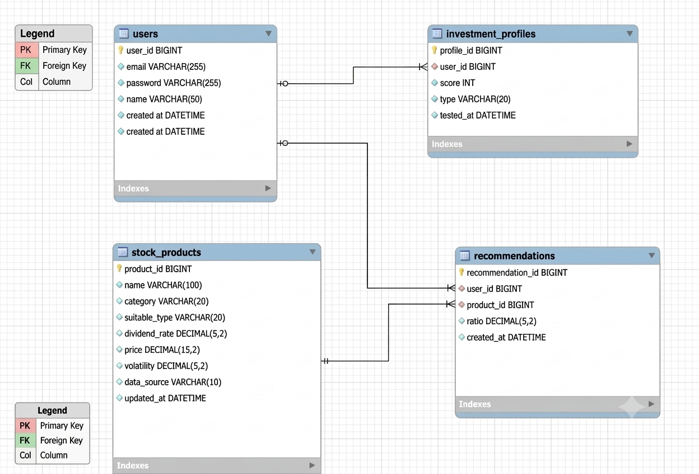

# 프로젝트 진행 상황 (Progress Log)

> 주간 주요 작업: 프로젝트 개정, 공공 API 키 발급, DB ERD/모델링 완성, 환경 구축
---

  

  
ERD 보기 (클릭)

  
  

## 단계별 진행 상황

| 단계 | 구분 | 주요 내용 | 상태 |
| :---: | :--- | :--- | :---: |
| **1단계** | **기획 및 설계** | • 주제, 데이터 출처, 투자성향 유형(3가지) 확정 • ERD 설계 (ERDCloud → MySQL Workbench 전환) | 🟢 |
| **2단계** | **환경 구축** | • Spring Boot 4.1.1 프로젝트 생성 • MySQL Forward Engineering 테이블 생성 및 연동 테스트 | 🟢 |
| **3단계** | **데이터 수집** | • 공공데이터포털 API 연동 & 배당주/시세 데이터 수집 • ETF 20여 개 분배금 수동 조사 및 DB 초기 데이터 구축 | `IN PROGRESS` |
| **4단계** | **회원 기능** | • 로그인 및 회원가입 기능 구현 | 🟡 |
| **5단계** | **투자성향 진단** | • 사용자 맞춤형 투자성향 설문 기능 구현 | 🟡 |
| **6단계** | **추천 로직** | • 데이터 기반 자산 배분 및 포트폴리오 추천 알고리즘 구현 | 🟡 |
| **7단계** | **마무리** | • 통합 테스트, README 작성 및 발표 자료 준비 | 🟡 |

### 진행 고려사항
- **(선택) 로컬 Docker 컨테이너화**
- 뉴스 크롤링/알림 서비스
- 해외 상품·채권 확장
- 레버리지·인버스 등 변동성 상품 확장

---

## 주요 개정 내역

| 구분 | 초기 구상 | 최종 결정 |
|---|---|---|
| **주제 범위** | 레버리지/인버스/커버드콜 등 파생상품 전반 | 배당주 + 커버드콜 ETF + 월배당 ETF (분배율 기준 로직 통일) |
| **데이터 확보** | 공공데이터 API로 전체 자동화 예상 | ETF 분배금 전용 공공 API 없음 확인 → 배당주는 API, ETF는 대표 종목 수동 조사로 보완 |
| **투자성향 유형** | 원금보장 추구 / 고배당 추구 / 분배형 | 원금집중형 / 균형형 / 배당집중형 (3유형, 규칙 3세트) — "원금보장"은 부정확한 표현이라 정정 |
| **데이터 갱신** | 전부 실시간 자동 갱신 가정 | 가격·변동성은 API 자동(주 단위), 배당·분배율은 수동 스냅샷 |
| **추천 로직** | 미정 | 규칙기반(rule-based), 향후 협업/콘텐츠 기반 필터링으로 고도화 여지 |
| **ERD 설계** | - | investment_profiles는 **이력 관리** 위해 profile_id 별도 PK 유지, 테이블명 복수형(snake_case) 통일 |
| **(미확정)배포** | 클라우드 배포 고려 | 시간 제약상 로컬 Docker 컨테이너화만 선택적 고려 |

---

