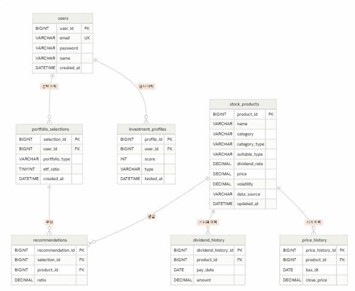

<!-- _class: lead -->

# 4주차 진행 보고
### 추천 로직 설계 · ERD 개정

투자성향 기반 배당포트폴리오 추천 웹서비스

---

## 이번 주 요약

1. **추천 로직 방향** 확정 — 배당주 엔진 / ETF 엔진 2엔진 구조
2. **상품 구성** 42종목(배당주 26 + ETF 16) 선정 근거 정리
3. **배당주 엔진** 수식·실행순서 정리, 더미데이터 실행
4. **ETF 엔진** 수식·실행순서 정리, 더미데이터 실행
5. **ERD 개정** — 4테이블 → 7테이블
6. **다음 단계** — API 실데이터로 목표구간 검증 → DB 수정 → 로그인 구성

---

<!-- _class: lead -->

# Part 0. 추천 로직 방향

---

## 추천 로직 방향

<!-- 지난 발표 피드백 내용을 여기에 한 줄로 추가 -->

- 배당주와 ETF는 데이터 성격이 달라 **엔진을 분리**
  - 배당주: 배당률 API 제공 / ETF: 분배금 API 없음(SEIBro 수동조사)
  - ETF는 같은 지수를 여러 운용사가 추종 → 카테고리 단위로 처리
- 두 엔진이 **같은 스코어링 공식을 재사용** (정규화 → 가중치 → 점수비례 비중)
- 성향검사 결과는 **기본으로 보여줄 유형**만 결정, 3유형 포트폴리오는 항상 조회 가능
- 사용자가 정한 **ETF:배당주 비율(10% 단위)**로 두 결과를 블렌딩 (사용자 선택)

---

## 엔진 분리 근거 (1/2) — 자산 성격

배당주와 ETF는 자산의 법적·구조적 성격 자체가 다름

| | 배당주 | ETF |
| --- | --- | --- |
| 성격 | 개별 기업의 지분 증권 | 여러 종목을 담은 펀드(집합투자기구) |
| 연동 | 기업 실적·재무상태에 직접 연동 | 지수·바스켓 단위로 분산 |

→ 이 구조적 차이 때문에 **데이터 출처와 계산 로직도 근본적으로 달라짐**

---

## 엔진 분리 근거 (2/2) — 데이터·계산

- **배당주**: 배당률을 API(금융위원회_주식배당정보)가 직접 제공 → 계산 없이 캐싱
- **ETF**: 분배율 제공 API 없음 → 분배금(원화) 수동조사 후 연환산 계산 필요
- **ETF**: 같은 지수를 여러 운용사(KODEX/TIGER 등)가 내놓는 구조 → 카테고리 단위 계산 + 상품 나열이라는 별도 처리 필요

결론
- 하나의 로직으로 묶지 않고 **배당주 엔진 · ETF 엔진 두 개로 분리**
- 각 엔진은 독립적으로 완결된 포트폴리오를 산출
  → 비율로 합산해도 되고, 배당주만 / ETF만 단독으로 써도 됨

---

## 전체 구조

```
[성향검사] → 기본 유형 (원금집중 / 균형 / 배당집중)
                    │
      ┌─────────────┴─────────────┐
  [배당주 엔진]                [ETF 엔진]
  그룹A 12 + 그룹B 14          LISTED 3 + SINGLE 10
      └─────────────┬─────────────┘
                    │
       ETF:배당주 비율로 블렌딩 (portfolio_selections.etf_ratio)
                    │
              최종 포트폴리오
```

---

<!-- _class: lead -->

# Part 1. 상품 구성 (42종목)

---

## 배당주 선정 로직

**그룹A (고배당)**
- 한국예탁결제원 SEIBro 배당순위(유가증권시장, 시가배당률 기준) 상위권 종목을 1차 후보로 선정
- AI 검색으로 최근 재정 악화·배당 삭감 이력을 교차 검증
- 자료가 부족한 종목은 SEIBro 재무제표(부채비율, 영업이익 등)를 직접 대조해 안정성 재확인

**그룹B (대형안정)**
- 국내 주요 금융지주·증권사·보험사 중 시가총액 상위 대형사를 기준으로 직접 선정

---

<!-- _class: small -->

## 배당주 구성 (26종목)

| 그룹 | 성격 | 종목 |
| :---: | :---: | :--- |
| **A** (12) | 고배당 | 한솔로지스틱스, 한국특강, 에이치에스애드, 에스앤티홀딩스, 경농, 교보증권, 에스앤티모티브, 롯데쇼핑, 한국철강, 유안타증권, 강원랜드, 대신증권 |
| **B** (14) | 대형안정 | KB금융, 신한지주, 하나금융지주, 우리금융지주, 기업은행, 한국금융지주, NH투자증권, 미래에셋증권, 삼성증권, 키움증권, 삼성화재, 삼성생명, 한화생명, DB손해보험 |

- A·B 26종목 **전체를 한 풀로 정규화**, 유형별로 A:B 개수만 다르게 선정

---

## ETF 선정 로직 (1) — 상품 유형 제한

- 레버리지·인버스 등 변동성 기반 파생상품은 **제외**
- 분배금(배당) 기반 상품만 후보로 한정
- 범위: **지수추종 / 다우존스 배당지수 추종 / 커버드콜 ETF**

---

<!-- _class: small -->

## ETF 선정 로직 (2) — 지수추종: KODEX·TIGER

- 국내 ETF 시장은 삼성자산운용(KODEX)·미래에셋자산운용(TIGER)이 전체 순자산의 70% 이상 (2026년 상반기 기준)
- 지수추종은 상품 간 성과 차이가 거의 없음 → **유동성(거래량)이 큰 쪽**이 매매 편의상 유리
- 그래서 KODEX·TIGER 2개 운용사로 압축

**지수 대상: S&P500 · 나스닥100**
- 코스피·코스닥 1배 지수추종은 분배수익률 각각 1.4~1.5%, 0.05~0.3% 수준으로 매력이 낮고
- 미국 지수 대비 변동성도 높다고 평가되어 제외

---

## ETF 선정 로직 (3) — 다우존스 배당: AUM 기준

- 국내 상장 미국배당다우존스 추종 ETF(TIGER / SOL / ACE / KODEX) 중 **순자산총액(AUM) 상위 TIGER·SOL 2개**로 압축
  - TIGER 약 3.8~4.2조원, SOL 약 1조원 — ACE·KODEX 대비 규모 차이 뚜렷
- 국내 고배당주 ETF인 **PLUS 고배당주**를 추가해 배당목적 ETF군 구성

---

## ETF 선정 로직 (4) — 동일 지수 상품 처리

- S&P500·나스닥100(KODEX/TIGER), 다우존스 배당(TIGER/SOL)처럼 같은 기초지수 상품은 성과 차이가 사실상 없음
  → **스코어링으로 우열을 가리지 않음**
- 대표 1개를 임의로 고르지 않고
  - 카테고리 단위로 **비중만 계산**
  - 해당 카테고리 상품을 **전부 나열**
  - 현재시세 + 최근 3개월 분배금 내역(평균 포함)을 함께 보여줌
- **실제 종목 선택은 사용자에게** 맡김

---

<!-- _class: small -->

## ETF 선정 로직 (5) — 커버드콜: 기초자산 중복 제거

- 순자산 상위 커버드콜 ETF 조사 결과, 코스피200 기초자산 상품만 4종(SOL·KODEX·RISE 등)이 겹치는 등 **중복 확인**
- 채권(미국 국채30년) 기초자산 상품은 이번 학기 범위(주식형 분배 상품)와 맞지 않아 제외
- **기초자산이 서로 다른 상품만** 남겨 중복 제거

→ 다우존스 배당 · S&P500 · 나스닥100 · 코스피200 · 국내배당(액티브) · 미국배당성장(액티브)
**비섹터 커버드콜 6개** 확정

---

<!-- _class: small -->

## ETF 선정 로직 (6) — 섹터: 커버드콜 유무로 결정

- 순수 지수추종형 섹터 ETF(예: 반도체 TOP10)는 분배수익률 0.2~0.3%대 → **제외**
  - 성장산업 특성상 이익을 배당보다 재투자에 쓰는 구조로 분석됨
- 옵션 프리미엄으로 분배 재원을 만드는 **섹터 커버드콜 ETF는 포함 대상**
- 실제 상품 조사 결과 **반도체 · 금융 · 미국AI밸류체인 3개 섹터**만 커버드콜 상품 확인
- 자동차·전력·의료 섹터는 커버드콜 상품 미확인 → 향후 방향(재확인 필요)으로 이관

---

## ETF 선정 로직 (7) — 타겟 vs 액티브

| | 타겟형 | 액티브형 |
| --- | --- | --- |
| 운용 | 정해진 규칙대로 기계적으로 옵션 매도 | 매니저가 재량으로 종목·옵션 조절 |
| 추가 리스크 | 상승분 제한 | 매니저 판단 |

- 어느 한쪽이 구조적으로 더 위험한 것은 아님
- 이 차이는 별도 규칙 없이 **실제 변동성(volatility) 데이터에 자연스럽게 반영**되도록 설계

---

## ETF 구성 (16종목) — 지수추종 · 배당

지수추종 4 + 다우존스·배당목적 3

| 구분 | 기초자산 | 상품명 |
| :---: | :--- | :--- |
| 지수추종 | S&P500 | KODEX 미국S&P500 |
| 지수추종 | S&P500 | TIGER 미국S&P500 |
| 지수추종 | 나스닥100 | KODEX 미국나스닥100 |
| 지수추종 | 나스닥100 | TIGER 미국나스닥100 |
| 배당목적 | 미국배당다우존스 | TIGER 미국배당다우존스 |
| 배당목적 | 미국배당다우존스 | SOL 미국배당다우존스 |
| 배당목적 | 국내 고배당주 | PLUS 고배당주 |

---

<!-- _class: small -->

## ETF 구성 (16종목) — 커버드콜

비섹터 6 + 섹터 3

| 구분 | 기초자산 | 상품명 |
| :---: | :--- | :--- |
| 비섹터 | 미국배당다우존스 | TIGER 미국배당다우존스타겟커버드콜 |
| 비섹터 | S&P500 | TIGER 미국S&P500타겟데일리커버드콜 |
| 비섹터 | 나스닥100 | TIGER 미국나스닥100타겟데일리커버드콜 |
| 비섹터 | 코스피200 | SOL 200타겟위클리커버드콜 |
| 비섹터 | 국내배당 | TIGER 배당커버드콜액티브 |
| 비섹터 | 미국배당성장 | KODEX 미국배당커버드콜액티브 |
| 섹터 | 반도체 | TIGER 반도체TOP10커버드콜액티브 |
| 섹터 | 금융 | KODEX 금융고배당TOP10타겟위클리커버드콜 |
| 섹터 | AI인프라 | RISE 미국AI밸류체인데일리고정커버드콜 |

---

<!-- _class: lead -->

# Part 2. 배당주 엔진

---

## 2-1. 정규화 (26개 전역 min-max)

```
안정성점수 = 100 - (변동성 - 전역최소변동성)
                   / (전역최대변동성 - 전역최소변동성) × 100

수익성점수 = (배당률 - 전역최소배당률)
                   / (전역최대배당률 - 전역최소배당률) × 100
```

- 그룹A 12 + 그룹B 14, **26개 후보군 내 상대 위치(0~100)**
- 절대 수치 자체엔 의미 없음
- 후보군 값이 전부 같으면(max = min) **50점 고정**

---

## 2-2. 종합점수와 가중치

```
종합점수 = 안정성점수 × stabilityWeight + 수익성점수 × profitWeight
```

| 유형 | 안정성 | 수익성 |
| --- | --- | --- |
| 원금집중형 | 0.7 | 0.3 |
| 균형형 | 0.5 | 0.5 |
| 배당집중형 | 0.3 | 0.7 |

- 0.2 간격 3분할 → 유형 간 결과 차이가 뚜렷하게 나오도록 설계
- 사용자 자율 가중치는 **채택 안 함** (편의 저해, 극단적 비중 방어)
- 현재는 임시값 → 실데이터에서 차이가 뚜렷하지 않으면 조정 가능

정렬(동점 처리): 종합점수 ↓ → 배당률 ↓ → 종목ID ↑

---

## 2-3. 슬롯(개수) 결정

유형별 그룹A : 그룹B 후보 조합

| total | 원금집중형 | 균형형 | 배당집중형 |
| --- | --- | --- | --- |
| 8 | 2:6 | 4:4 | 6:2 |
| 9 | 2:7 / 3:6 | 4:5 | 7:2 / 6:3 |
| 10 | 2:8 / 3:7 | 5:5 | 8:2 / 7:3 |

- total은 **10 → 8 순서로 탐색** (동점 시 종목 수 많은 쪽 우선 — 분산투자)
- 각 조합의 **배당률 가중평균**이 목표구간에 가장 가까운 조합 채택

---

## 2-4. 목표구간과 Penalty

| 유형 | 목표 배당률 |
| --- | --- |
| 원금집중형 | 6 ~ 7% |
| 균형형 | 7 ~ 8.5% |
| 배당집중형 | 8.5 ~ 10% |

```
penalty = 0                    (가중평균이 구간 안)
penalty = 구간하한 - 가중평균   (하한보다 낮을 때)
penalty = 가중평균 - 구간상한   (상한보다 높을 때)
```

→ penalty 최소 조합 채택

---

## 2-5. 비중 배분

```
비중_i = (종목_i 종합점수 / 선정 종목 종합점수 합) × 100
마지막 종목 = 100 - (나머지 종목 비중 합)   ← 반올림 오차 보정
```

- 그룹A/B를 **같은 전역 정규화 점수**로 계산했기 때문에
- 그룹 간 배분 기준을 따로 둘 필요 없이, **점수 비례 하나로 그룹 간·그룹 내 비중이 동시에 결정**

---

## 2-6. 실행 순서

```
Main.main()
 ├─ buildGroupA() / buildGroupB()   ← 지금: 랜덤 더미 / 이후: DB 조회
 └─ for 유형 in (원금집중, 균형, 배당집중):
      PortfolioSlotOptimizer.optimizeStock(groupA, groupB, 유형)
       ├─ 전역 min/max 계산 (26개)
       ├─ for total = 10 → 8:
       │    for 후보 조합:
       │      ├─ selectTopWithGlobalNorm(그룹A, countA)
       │      ├─ selectTopWithGlobalNorm(그룹B, countB)
       │      ├─ mergeAndRebalance()
       │      ├─ weightedAverageDividend()
       │      └─ penalty 계산 → 최소값 갱신
       └─ 최적 조합(StockPlan) 반환
```

---

## 2-7. 실데이터 교체 지점

| 현재 (임시) | 교체 후 (실제) |
| --- | --- |
| buildGroupA/B의 Random(seed) | stock_products SELECT |
| dividendRate 랜덤값 | getDiviInfo_V2 응답값 그대로 저장 |
| volatility 랜덤값 | price_history 최근 60영업일 종가로 계산 |

→ **입력 경로만 바뀌고 로직 코드는 거의 수정 없음**

---

<!-- _class: lead -->

# Part 3. ETF 엔진

---

## 3-1. 카테고리 구성

**LISTED (3개, 항상 포함)**
- S&P500 추종 · 나스닥100 추종 · 다우존스배당 추종 (각 2개 운용사)
- 같은 지수 상품은 대표 선정 없이 **전부 나열**, 카테고리 비중만 계산

**SINGLE (10개, 점수 기반 선정)**
- 국내고배당 1 + 커버드콜 9
  (다우 / S&P500 / 나스닥 / 코스피200 / 국내배당 / 미국배당성장 / 반도체 / 금융 / AI밸류체인)

**브랜드 동결**: AUM 쏠림은 관성이 있어 자주 바뀌지 않는다고 판단해 2개사로 동결. 운용사 추가 시 **데이터 행만 추가**하면 됨

---

## 3-2. 스코어링

**LISTED — 스코어링 없음**
- 같은 지수를 따라가는 패시브 상품 → 점수로 우열을 가릴 실익 없음
- 카테고리 안 상품은 **균등분배**

**SINGLE — 배당주와 같은 공식 재사용**
```
안정성점수 = 100 - (변동성 - 최소) / (최대 - 최소) × 100
수익성점수 = (배당률 - 최소) / (최대 - 최소) × 100
종합점수   = 안정성 × stabilityWeight + 수익성 × profitWeight
```
- 정규화는 **SINGLE 10개 풀 안에서만** (LISTED와 분리)
- 가중치·정렬 규칙은 배당주와 동일

---

## 3-3. 비중과 선정 개수

| 유형 | LISTED : SINGLE | SINGLE 개수 | 총 카테고리 | 목표 분배율 |
| --- | --- | --- | --- | --- |
| 원금집중형 | 70 : 30 | 2~3 | 5~6 | 2 ~ 5% |
| 균형형 | 50 : 50 | 3~4 | 6~7 | 5 ~ 8% |
| 배당집중형 | 30 : 70 | 4~5 | 7~8 | 8 ~ 15% |

- LISTED 3개는 탐색 대상이 아니라 **항상 고정**
- SINGLE 개수 범위 안에서 **penalty 최소** 개수 채택 (공식은 배당주와 동일)
- 배당집중형일수록 SINGLE 개수를 늘림 → **큰 비중이 소수 카테고리에 몰리는 위험 완화**

---

## 3-4. 비중 배분

```
[LISTED] 카테고리당 비중 = 유형별 LISTED 비중(%) ÷ 3

[SINGLE] 비중_i = (종합점수_i / 선정 종합점수 합) × 100
                  × (SINGLE 비중% / 100)

전체 병합 후: 마지막 카테고리 = 100 - (나머지 비중 합)
```

- LISTED는 균등, SINGLE은 배당주와 같은 점수비례 방식

---

## 3-5. 실행 순서

```
Main.main()
 ├─ buildListedCategories() / buildSingleCategories()
 │    ← 지금: 랜덤 더미 / 이후: DB(category_type 필터) 조회
 └─ for 유형 in (원금집중, 균형, 배당집중):
      EtfPortfolioOptimizer.optimizeEtf(listed, single, 유형)
       ├─ weightSplit(유형) → LISTED:SINGLE 비중
       ├─ for SINGLE 개수 in 유형별 범위:
       │    ├─ selectTop(single, count, 유형)
       │    ├─ allocateListedEqually()
       │    ├─ rescaleRatio()
       │    ├─ 병합 + finalizeRounding()
       │    ├─ weightedAverageDividend()
       │    └─ penalty 계산 → 최소값 갱신
       └─ 최적 조합 반환
```

---

## 3-6. 실데이터 교체 지점

| 현재 (임시) | 교체 후 (실제) |
| --- | --- |
| buildListed/SingleCategories의 Random(seed) | stock_products에서 category_type으로 필터 |
| 카테고리 dividendRate | (최근 3개월 분배금 합계 / 현재가) × 4 × 100, 여러 상품이면 평균 |
| 카테고리 volatility | price_history 최근 60영업일 종가로 계산, 여러 상품이면 평균 |

→ 배당주 엔진과 마찬가지로 **로직 자체는 그대로 재사용**

---

<!-- _class: lead -->

# Part 4. ERD 개정

---



## ERD

4테이블 → **7테이블**

- 신규: price_history, dividend_history, portfolio_selections
- 변경: stock_products, recommendations

---

<!-- _class: small -->

## 주요 변경사항

| 테이블 | 구분 | 내용 |
| --- | --- | --- |
| price_history | 신규 | 종가 이력 → 변동성 계산 원천 (API가 변동성 미제공). 60영업일 롤링 삭제 |
| dividend_history | 신규 | ETF 분배금 이력. 삭제 없이 누적, 최근 3건 조회 |
| portfolio_selections | 신규 | 사용자가 확정한 포트폴리오 헤더 (portfolio_type, etf_ratio). 재선택 시 새 행 |
| stock_products | 변경 | category_type 추가 (SELECTIVE / LISTED / SINGLE) — 로직 분기 기준 |
| recommendations | 변경 | user_id → selection_id FK, created_at 제거(헤더와 중복) |

---

## 설계 결정 포인트

**recommendations는 상품 단위로 저장**
- 화면에 종목명을 바로 나열 가능
- 카테고리 단위로 저장하면 나중에 운용사 추가 시 과거 이력이 현재 기준으로 재계산되는 **이력 왜곡** 발생

**dividend_rate는 연환산 % 캐시값**
- 배당주: API 배당률 그대로 / ETF: 최근 3개월 분배금 기준 환산
- 데이터 미확보 시 NULL → 추천에서 자동 제외 (NOT NULL 걸지 않음)

**이력 관리 원칙 유지**
- investment_profiles · portfolio_selections · recommendations 모두 덮어쓰지 않고 누적

---

<!-- _class: lead -->

# 진행 단계 계획

---

<!-- _class: small -->

## 진행 단계 (1/2)

| 순서 | 단계 | 내용 | 상태 |
| :---: | :--- | :--- | :---: |
| 1 | 로직 구현 검증 | 순수 Java(더미데이터) — enum / record / RecommendationEngine / PortfolioSlotOptimizer / PortfolioBlender / Main | 🟢 |
| 2 | DB 스키마 재설계 | 7테이블 ERD 확정 (price_history · dividend_history · portfolio_selections 신규), is_representative 등 폐기 설계 정리, stock_products에 category / category_type / suitable_type 반영 | 🟢 |
| 3 | Spring Boot 재구축 | 엔티티 / 리포지토리 / JPA 매핑 (InvestorType enum @Enumerated 등), MySQL Forward Engineering | `IN PROGRESS` |
| 4 | 실데이터 수집 마무리 | 주식시세 API 실연동 테스트, ETF 분배율 수동조사 완료, 종목 리스트 DB 입력, 실데이터로 목표구간 검증 | `IN PROGRESS` |
| 5 | 로직 ↔ 서비스 계층 연결 | 순수 로직을 컨트롤러 / 서비스에 연결, DB에서 Product 조회하도록 교체 | 🟡 |

---

<!-- _class: small -->

## 진행 단계 (2/2)

| 순서 | 단계 | 내용 | 상태 |
| :---: | :--- | :--- | :---: |
| 6 | 회원 기능 | 로그인 / 회원가입 (Spring Security, 구글 OAuth2) | 🟡 |
| 7 | 투자성향 설문 | 설문 → 점수 → 3유형 분류, investment_profiles 저장 | 🟡 |
| 8 | 프론트엔드 (React, 최소범위) | 설문 화면, 3종 포트폴리오 전환 UI, 블렌드 비율 입력, 최종 선택 저장 | 🟡 |
| 9 | 통합 테스트 | 전체 흐름 (가입 → 설문 → 추천 → 선택 저장) 확인 | 🟡 |
| 10 | 문서 / 발표 정리 | README 갱신, 발표자료 | 🟡 |