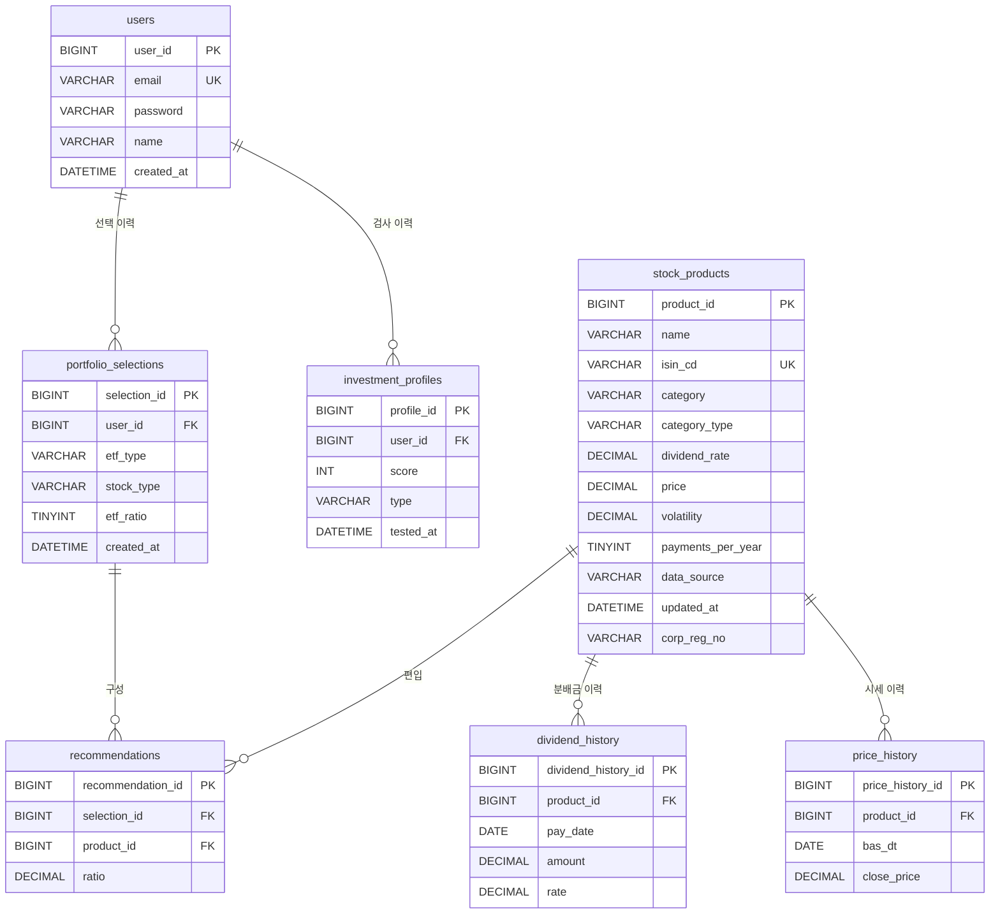

# ERD 설계 명세서 (확정본) — 투자성향 기반 배당포트폴리오 추천 웹서비스

테이블 7개 구성. 기존 db.md(4테이블) 대비 `price_history`, `dividend_history` 신규 분리 / `stock_products`, `portfolio_selections`, `recommendations` 구조 변경.

구현 SQL은 `schema_full.sql`(DB명 `investment_portfolio`, InnoDB, utf8mb4)이며, 이 문서는 그 SQL과 일치하도록 맞춘 명세서임. 유형·카테고리 값은 한글이 아니라 enum 이름으로 저장함(아래 "저장 값 정리" 참고).

---

## ERD 다이어그램

**관계 요약**
- `users` 1 : N `investment_profiles` — 성향검사 이력 (여러 번 검사 가능)
- `users` 1 : N `portfolio_selections` — 사용자가 확정 저장한 포트폴리오 이력 (재선택 시마다 새 행)
- `portfolio_selections` 1 : N `recommendations` — 포트폴리오 1건 = 종목 여러 행
- `stock_products` 1 : N `price_history`, `dividend_history`, `recommendations`
- `investment_profiles`와 `portfolio_selections`/`recommendations` 사이에는 FK가 없음. 서버가 최신 검사 type 하나를 읽어 추천 로직에 파라미터로 넘길 뿐, DB 관계는 아님.

---

## 1. users

| 컬럼 | 타입 | 제약조건 | 비고 |
|---|---|---|---|
| user_id | BIGINT | PK, AUTO_INCREMENT | 다른 테이블에서 FK로 참조하므로 문자열(email)보다 효율이 좋은 정수 PK 사용 |
| email | VARCHAR(255) | UNIQUE, NOT NULL | 로그인 아이디, 중복 가입 방지 |
| password | VARCHAR(255) | NULL 허용 | BCrypt 암호화 저장(평문 금지). 구글 로그인 전용 계정은 비밀번호가 없어서 NULL 허용 |
| name | VARCHAR(50) | NOT NULL | 화면 표시용 이름 |
| created_at | DATETIME | NOT NULL | 가입일시 |

※ 구글 OAuth 관련 컬럼(`google_id`, `email_verified`)과 이메일 인증 토큰 테이블은 이 ERD와 `schema_full.sql`에 미반영. 로그인 단계에서 `ALTER`로 추가할 예정.

## 2. investment_profiles (성향검사 이력)

| 컬럼 | 타입 | 제약조건 | 비고 |
|---|---|---|---|
| profile_id | BIGINT | PK, AUTO_INCREMENT | 한 사용자가 여러 번 검사하므로 user_id만으로는 회차 구분이 안 돼 별도 PK 사용 |
| user_id | BIGINT | FK → users.user_id | 검사 결과의 소유자 |
| score | INT | NOT NULL | 설문 응답을 점수화한 값 |
| type | VARCHAR(20) | NOT NULL | InvestorType의 enum 이름(`PRINCIPAL`=원금집중형 / `BALANCED`=균형형 / `DIVIDEND`=배당집중형)을 저장. 포트폴리오 계산과 별개이며, 화면에 기본으로 보여줄 유형을 정하는 추천값 역할만 함 |
| tested_at | DATETIME | NOT NULL | 검사 시점. 성향 변화 추이 추적용 |

## 3. stock_products (배당주 26종 + ETF 16종 통합)

| 컬럼 | 타입 | 제약조건 | 비고 |
|---|---|---|---|
| product_id | BIGINT | PK, AUTO_INCREMENT | 상품 고유 식별자 |
| name | VARCHAR(100) | NOT NULL | 상품명 |
| isin_cd | VARCHAR(12) | UNIQUE, NULL 허용 | API 조회용 ISIN 종목코드. 시드에는 없고 API로 조회해 `UPDATE`로 채움. 가격·변동성 API(`isinCd` 파라미터)에서 종목을 식별할 때 사용 |
| category | VARCHAR(50) | NOT NULL | 카테고리 enum 이름(15종, 아래 "저장 값 정리" 참고). 별도 참조 테이블 없이 문자열로 관리하고, 조인 대상이 아니라 조회 시 필터 조건으로만 사용. 길이는 ERD 초안의 30에서 50으로 늘림(`COVERED_CALL_US_DIVIDEND_GROWTH`가 31자) |
| category_type | VARCHAR(20) | NOT NULL | SELECTIVE(그룹A/B, 점수기반 일부 선택) / LISTED(지수추종·다우존스배당, 전부 나열+비중만 계산) / SINGLE(커버드콜 등, 카테고리=상품 1:1). 추천 로직 분기의 핵심 구분값 |
| dividend_rate | DECIMAL(5,2) | NULL 허용 | 연배당 기준 배당률(%) 캐시값. 배당주는 배당정보 API 값을 그대로 저장하며 배치가 매일 무조건 덮어씀(공시 시점을 몰라도 항상 최신). ETF는 백엔드가 5번 테이블의 최근 3건 분배율로 연배당 환산한 결과를 저장(환산식은 백엔드 로직, DB에는 결과값만). 미확보 시 NULL이며 추천 후보에서 자동 제외되므로 NOT NULL 금지 |
| price | DECIMAL(15,2) | NULL 허용 | 현재가(종가). 배치가 최신값으로 덮어씀. 시드에는 비어 있고 배치가 채움 |
| volatility | DECIMAL(5,2) | NULL 허용 | 4번 테이블 최근 60영업일 종가로 일별수익률 표준편차를 직접 계산해 저장. API가 변동성 필드를 제공하지 않음. 시드에는 비어 있고 배치가 채움 |
| payments_per_year | TINYINT | NULL 허용, CHECK(1~12) | ETF 연 분배 횟수(월배당=12, 분기배당=4). 백엔드가 5번의 회차별 분배율을 연배당 기준으로 환산할 때 사용. 배당주는 NULL. 시드에는 비어 있고 종목별 확인 후 `UPDATE`로 채움 |
| data_source | VARCHAR(10) | NOT NULL | API / MANUAL. 시드 기준으로 배당주 26종은 API, ETF 16종은 분배율을 SEIBro에서 수동조사하므로 MANUAL |
| updated_at | DATETIME | - | 마지막 갱신 시각. 자동 갱신(JPA auditing 등). MANUAL 데이터는 기준 시점 확인용 |
| corp_reg_no | VARCHAR | NULL 허용 | 법인등록번호. 배당정보 API(`getDiviInfo_V2`)가 `isin_cd`가 아니라 법인등록번호(`crno`)와 회사명으로 조회되는 문제를 해결하려고 추가. 배당주 26종 대상, ETF는 NULL |

※ 유형 적합 여부를 나타내던 `suitable_type` 컬럼은 제거. 유형별 구성은 그룹/카테고리 소속과 점수 계산으로 매번 동적으로 결정되므로 상품에 유형 태그를 붙일 필요가 없음.

## 4. price_history (3개월 롤링 종가 이력)

| 컬럼 | 타입 | 제약조건 | 비고 |
|---|---|---|---|
| price_history_id | BIGINT | PK, AUTO_INCREMENT | 종목·날짜별 종가 1건을 식별 |
| product_id | BIGINT | FK → stock_products.product_id | 배당주·ETF 전 종목 대상 |
| bas_dt | DATE | NOT NULL | 기준일자. 영업일에만 데이터가 생성되므로 공휴일은 자동으로 빠짐 |
| close_price | DECIMAL(15,2) | NOT NULL | 그날의 종가. 3번 `volatility` 계산의 원재료 |

- 제약조건: `UNIQUE(product_id, bas_dt)` — 같은 종목·같은 날짜 중복 적재 방지
- 용도: 변동성 계산 전용 원재료 창고. 화면에 직접 보여주지 않음
- 삭제: 종목당 최신 60행(약 3개월)만 유지하고 오래된 행은 배치로 삭제. 달력일 기준보다 "최신 60행 유지" 방식이 공휴일 편차에 영향받지 않아 정확함

## 5. dividend_history (ETF 전용 분배금 이력)

| 컬럼 | 타입 | 제약조건 | 비고 |
|---|---|---|---|
| dividend_history_id | BIGINT | PK, AUTO_INCREMENT | 분배금 지급 1건을 식별 |
| product_id | BIGINT | FK → stock_products.product_id | ETF만 대상. 배당주는 API가 배당률을 직접 제공하므로 이 테이블을 쓰지 않음 |
| pay_date | DATE | NOT NULL | 분배금 지급일 (SEIBro 수동조사) |
| amount | DECIMAL(15,2) | NOT NULL | 분배금 금액(원화). 화면의 "최근 3건" 표시용 원본 |
| rate | DECIMAL(5,2) | NOT NULL | 회차별 분배율(%) 원본. 월별 분배금이 달라지는 ETF가 있어 금액 합산 환산 대신 회차별 분배율을 저장. 연환산은 하지 않고 원본 그대로 둠 |

- 제약조건: `UNIQUE(product_id, pay_date)` — 수동 입력 테이블이라 같은 분배금이 두 번 들어가는 걸 DB가 막음. 이 제약이 `(product_id, pay_date)` 인덱스 역할도 하므로 별도 인덱스는 불필요
- 삭제 없이 계속 누적. 조회는 `ORDER BY pay_date DESC LIMIT 3`
- 화면의 "3건 + 평균"은 3번의 `dividend_rate`를 재사용할 수 없으므로 화면 표시 때마다 이 테이블에서 원본 3건을 조회. 연환산 결과는 백엔드가 계산해 3번에 저장

## 6. portfolio_selections (사용자가 확정한 포트폴리오 헤더)

| 컬럼 | 타입 | 제약조건 | 비고 |
|---|---|---|---|
| selection_id | BIGINT | PK, AUTO_INCREMENT | 선택 건 1개를 식별. 7번이 이 값으로 종목들을 묶음 |
| user_id | BIGINT | FK → users.user_id | 선택한 사용자 |
| etf_type | VARCHAR(20) | NULL 허용 | ETF 쪽에서 사용자가 고른 유형(InvestorType enum 이름). ETF와 배당주를 서로 다른 유형으로 고를 수 있어 유형 컬럼을 둘로 분리함. 2번의 검사 결과와 달라도 됨. `etf_ratio`가 0이면 ETF 비중이 없으므로 NULL |
| stock_type | VARCHAR(20) | NULL 허용 | 배당주 쪽에서 사용자가 고른 유형. `etf_ratio`가 100이면 배당주 비중이 없으므로 NULL |
| etf_ratio | TINYINT | NOT NULL | 0~100, 10% 단위. 배당주 비중은 `100 - etf_ratio`라 별도 저장 안 함. 100이면 ETF 포폴만, 0이면 배당주 포폴만, 그 사이면 합산 포폴 |
| created_at | DATETIME | NOT NULL | 선택 시점. 마이페이지 이력의 날짜·정렬 기준 |

- 제약조건: `CHECK(etf_ratio BETWEEN 0 AND 100 AND MOD(etf_ratio, 10) = 0)`로 10% 단위만 허용. `CHECK((etf_ratio = 0 OR etf_type IS NOT NULL) AND (etf_ratio = 100 OR stock_type IS NOT NULL))`로 비중이 있는 쪽의 유형은 반드시 있어야 함
- 마이페이지 표시 예: `etf_type`=DIVIDEND, `stock_type`=PRINCIPAL, `etf_ratio`=70 → "ETF 배당집중형 70% + 배당주 원금집중형 30%"
- 재선택 시 덮어쓰지 않고 새 행이 계속 쌓임(UNIQUE 제약 없음). 성향검사 이력과 같은 이력 관리 원칙
- 마이페이지가 사용자별 최신순으로 조회하므로 `(user_id, created_at DESC)` 인덱스 권장
- 배당률 스냅샷은 저장하지 않음. 이력 화면에서는 배당률을 보여주지 않고 종목과 비중만 보여주기로 함
- 마이페이지의 "N종목"은 저장값이 아니라 7번에서 `selection_id`로 행 수를 셈

## 7. recommendations (포트폴리오 상세 종목)

| 컬럼 | 타입 | 제약조건 | 비고 |
|---|---|---|---|
| recommendation_id | BIGINT | PK, AUTO_INCREMENT | 종목 1행을 식별 |
| selection_id | BIGINT | FK → portfolio_selections.selection_id | 어느 포트폴리오 선택 건에 속하는지 연결 |
| product_id | BIGINT | FK → stock_products.product_id | 편입된 종목. 종목명·현재가 등은 저장하지 않고 이 값으로 3번을 조회 |
| ratio | DECIMAL(5,2) | NOT NULL | 선택 시점의 종목별 최종 편입 비중(%). 비중은 배치가 건드리지 않아 과거 이력을 열어도 그때 값 그대로 유지됨 |

- 상품 단위로 저장. LISTED 카테고리(예: S&P500추종)도 카테고리 비중을 소속 상품 수로 나눠 상품마다 행을 만듦. 화면에 종목을 그대로 나열해야 하고, 나중에 카테고리 내 상품이 늘어나도 과거 이력이 왜곡되지 않기 때문
- 제약조건: `UNIQUE(selection_id, product_id)` — 한 포트폴리오 안에서 같은 종목이 두 번 들어가는 것을 막음. 다른 시점의 포트폴리오끼리는 영향 없으므로 과거와 같은 종목·비중이 다시 나와도 저장됨. 이 제약이 `selection_id` 기준 조회용 인덱스 역할도 함
- 카테고리 정보는 저장하지 않음(3번 조회로 파악 가능)
- 생성 시각 컬럼 없음 — 6번의 `created_at`과 중복이라 제거

---

## 저장 값 정리 (`schema_full.sql` 기준)

**InvestorType** — `investment_profiles.type`, `portfolio_selections.etf_type`, `portfolio_selections.stock_type`에 저장

| 저장 값 | 화면 표시 |
|---|---|
| PRINCIPAL | 원금집중형 |
| BALANCED | 균형형 |
| DIVIDEND | 배당집중형 |

**stock_products.category / category_type** — 시드 42종목 (배당주 26 + ETF 16)

| category | category_type | 종목 수 | 구분 |
|---|---|---|---|
| GROUP_A_HIGH_DIVIDEND | SELECTIVE | 12 | 배당주 그룹A(고배당) |
| GROUP_B_LARGE_STABLE | SELECTIVE | 14 | 배당주 그룹B(대형안정) |
| INDEX_SP500 | LISTED | 2 | ETF 지수추종 (KODEX/TIGER) |
| INDEX_NASDAQ100 | LISTED | 2 | ETF 지수추종 (KODEX/TIGER) |
| DOW_DIVIDEND | LISTED | 2 | ETF 다우존스배당추종 (TIGER/SOL) |
| DOMESTIC_HIGH_DIVIDEND | SINGLE | 1 | ETF 국내고배당 (PLUS 고배당주) |
| COVERED_CALL_DOW | SINGLE | 1 | 커버드콜 비섹터 |
| COVERED_CALL_SP500 | SINGLE | 1 | 커버드콜 비섹터 |
| COVERED_CALL_NASDAQ100 | SINGLE | 1 | 커버드콜 비섹터 |
| COVERED_CALL_KOSPI200 | SINGLE | 1 | 커버드콜 비섹터 |
| COVERED_CALL_DOMESTIC_DIVIDEND | SINGLE | 1 | 커버드콜 비섹터 |
| COVERED_CALL_US_DIVIDEND_GROWTH | SINGLE | 1 | 커버드콜 비섹터 |
| COVERED_CALL_SEMICONDUCTOR | SINGLE | 1 | 커버드콜 섹터 |
| COVERED_CALL_FINANCE | SINGLE | 1 | 커버드콜 섹터 |
| COVERED_CALL_AI_VALUECHAIN | SINGLE | 1 | 커버드콜 섹터 |

- LISTED는 상품이 2개씩인 카테고리이며 카테고리 비중을 상품에 균등분배함. 나머지 카테고리는 상품 1개씩(SELECTIVE는 그룹 단위로 점수 기반 선택)

---

## 아직 확정되지 않은 항목

- **users 인증 컬럼**: 구글 로그인용 컬럼과 이메일 인증 관련 구조는 로그인 단계에서 `ALTER`로 추가할 예정

## 확인이 필요한 항목 (구현 단계)

1. **MySQL 버전**: `CHECK` 제약은 MySQL 8.0.16 이상에서만 실제로 동작하고, 그보다 낮으면 무시됨

## 보류 항목

- category 값 목록을 enum 클래스로 관리할지 참조 테이블로 관리할지(브랜드 확장 대비). 문자열 컬럼이라 스키마 영향 없음
- 5번 조회 성능은 실측 전까지 추정치 (42종목 × 3건 규모)